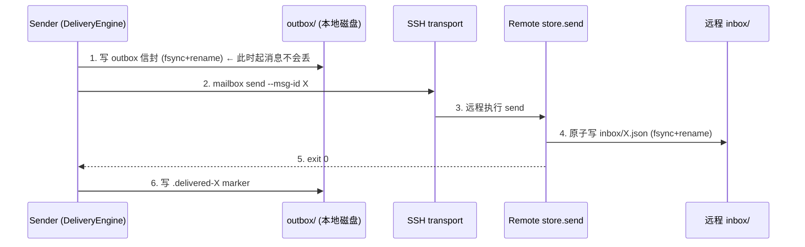

# AMQ 原子投递对照审计（2026-08）

对照对象：AMQ（Agent Message Queue）——file-based 消息 + crash-safe 原子投递 + 跨会话路由（单机文件，无跨主机 transport，详见 [external-comparison.md](./external-comparison.md)）。
被审对象：codeagent-py v0.2.1 的 mailbox + DeliveryEngine（durable outbox → SSH transport → 远程 inbox）。

**审计结论：当前设计已覆盖 AMQ 的全部原子性/幂等承诺，且额外提供跨主机 transport 与 opaque cursor。本审计为文档确认，无必须整改项；列出 2 个可选改进点（见 §6）。**

## 1. 对照表

| 维度 | AMQ | codeagent-py（我们） | 审计结果 |
|------|-----|---------------------|---------|
| 原子写入 | tmp→rename+fsync（[依据](./external-comparison.md) P3） | 同款：`.tmp-*` → `flush()+fsync` → `os.replace` | 等价，见 §2 |
| 幂等 | msg_id / correlation_id 去重 | msg_id 双端去重：发送方 outbox 去重 + 接收方 inbox/history 拒绝重复 | 我们更强（双端），见 §3 |
| 回执 | sync 写回 sender outbox（单机内同步完成） | transport 异步回执：投递回执同步（exit code / SendReceipt），消费回执异步（`.status-*` 状态目录 + kernel ack） | 语义等价，时序不同，见 §4 |
| cursor | 无 | opaque cursor `epoch_ms/seq`（`.stream-cursor`，原子更新） | 我们独有增量，见 §5 |
| 跨主机 | 无（单机文件） | SSH ControlMaster wire + durable outbox | 我们覆盖 AMQ 未覆盖的场景 |

## 2. 原子性审计

统一模式：**先写同目录 `.tmp-*` 临时文件（write → flush → fsync），再 `os.replace` 原子改名**。读者只可能看到「旧状态」或「完整新文件」，不可能看到半写文件。所有目录扫描（`list_messages`）显式跳过 `.tmp-*` 前缀（[store.py:73-75](../src/codeagent/mailbox/store.py)），防扫描竞态。

| 写入点 | 实现 | 位置 |
|--------|------|------|
| 本地 inbox 信封 | `.tmp-{msg_id}.json` → fsync → replace | [store.py:251-257](../src/codeagent/mailbox/store.py) |
| durable outbox 信封 | 同上 | [delivery.py:508-520](../src/codeagent/swarm/delivery.py) |
| session.json（创建/merge） | `.tmp-session.json` → fsync → replace | [store.py:111-116, 130-135](../src/codeagent/mailbox/store.py) |
| canonical history | O_EXCL tmp（并发重复 append 直接失败）→ fsync → replace | [store.py:357-365](../src/codeagent/mailbox/store.py) |
| stream cursor | `.tmp-stream-cursor` → fsync → replace | [store.py:299-304](../src/codeagent/mailbox/store.py) |
| agent status.json | `.tmp-status.json` → fsync → replace | [store.py:639-644](../src/codeagent/mailbox/store.py) |

与 AMQ 逐字节同款（tmp→rename+fsync）。与 AMQ 一样，**原子性是"单文件级"而非"多文件事务"**：broadcast 写 N 个收件人 inbox + 1 条 history 是逐个原子的，中途 crash 会产生部分送达——该窗口由 §3 的 msg_id 幂等兜底，见 §6.1。

## 3. 幂等审计

msg_id 格式：`{sender}_{YYYYMMDDTHHMMSS}_{6位随机}`（[store.py gen_msg_id](../src/codeagent/mailbox/store.py)），CLI `--msg-id` 可显式传入（[cli.py:54](../src/codeagent/mailbox/cli.py)），重试复用同一 msg_id。

- **发送方（outbox 侧）**：`_write_outbox` 若 `dest.exists()` 直接跳过（[delivery.py:510-511](../src/codeagent/swarm/delivery.py)）；`_check_idempotency` 对已存在 msg_id 从 marker 重建回执（`.delivered-{msg_id}` 存在 → delivered，否则 accepted/queued），并缓存于进程内 `_cache`（[delivery.py:687-707](../src/codeagent/swarm/delivery.py)）。
- **接收方（inbox/history 侧）**：`store.send` 收到显式 msg_id 时，若任一收件人 inbox 或 history 已有该 msg_id 则抛 `ValueError("msg_id already exists")`（[store.py:218-225](../src/codeagent/mailbox/store.py)）；`append_history` 用 O_EXCL 保证同一 msg_id 的 history 记录不可能被覆盖（[store.py:355-365](../src/codeagent/mailbox/store.py)）。
- **广播**：同一 msg_id 分发到每个收件人 inbox，history 只落一条（[store.py:259](../src/codeagent/mailbox/store.py)）。

结论：双端去重，比 AMQ 单点去重更严。重发（无论 flush 重试还是手动重发）都不会产生重复消息。

## 4. 回执审计

- **AMQ**：发送操作内同步把回执写回 sender outbox（单机、同进程语义下天然同步）。
- **我们**：分两层。
  - **投递回执（同步）**：`deliver()` 返回 `SendReceipt`（accepted/delivered/failed，[delivery.py:37-48](../src/codeagent/swarm/delivery.py)）。transport 调用 exit 0 即视为 delivered——远程 `send` 命令只在远程 inbox 原子写成功后才返回 0（[cli.py:144-149](../src/codeagent/mailbox/cli.py)），因此 delivered 语义与 AMQ 的"写回 sender outbox"等价（对远程 inbox 的确认），且 outbox 信封本身就是可持久化的回执载体。
  - **消费回执（异步）**：`.status-{msg_id}/phase` 状态目录记录 transport_failed / local_delivery_failed / ack / consumed（[delivery.py:671-683, 466-475](../src/codeagent/swarm/delivery.py)）；收件方 receiver 处理成功即 `finalize_from_inbox` 并回调 kernel ack（[receiver.py:274-287](../src/codeagent/swarm/receiver.py)）。跨主机消费回执不自动回传 sender，靠消息回程（如 NOTICE/RESPONSE）触发 sender 侧 `ack()` 落盘——这是与 AMQ 唯一的语义差异：AMQ 单机内回执路径全同步，我们跨主机需要业务回程或主动 flush 才能观测到 consumed。

## 5. cursor 语义审计

AMQ 无 cursor（[依据](./external-comparison.md)）。我们持有 opaque cursor：`<session_dir>/.stream-cursor` 存 `{'epoch_ms': N, 'seq': N}`，每条发送前 `advance_cursor` 原子推进并写入信封 `_cursor` 字段（[store.py:267-306](../src/codeagent/mailbox/store.py)）。消费者不解析内容、只作不透明令牌用于断线续读（真机测试：watch 断线重连续读全部消息，[real-machine-tests-2026-08.md](./real-machine-tests-2026-08.md)）。这是对 AMQ 的净增能力，无对应审计风险。

## 6. crash 窗口分析

以跨主机发送为例，关键时序：

逐窗口分析（P = 进程 crash / 网络断）：

| 窗口 | 现象 | 后果 | 兜底 |
|------|------|------|------|
| 1 前 | 信封未落盘 | 消息未发送 | 无损失 |
| 1→2 | 信封在 outbox，未 transport | pending；重启/`flush()` 重发 | 重发收敛 |
| 2→4 | transport 中 crash/断连 | 远程可能已写、可能未写 | 重发 + 接收方 msg_id 去重 |
| 4→5 | 远程已写 inbox，回执未达 | sender 不知情，标记 pending | 重发被远程"already exists"拒绝（见 §6.1） |
| 5→6 | 远程已确认，`.delivered` 未写 | 同上 | 同上 |

**结论：任何窗口都不丢消息（at-least-once），且接收方 msg_id 去重保证不重复投递（对已去重的接收方即 exactly-once-effect）。唯一非收敛点是窗口 4→5 / 5→6（见下）。**

### 6.1 已知非收敛点：重发遇 "already exists" 被当失败

窗口 4→5/5→6 crash 后，`.delivered-X` 缺失 → `flush()` 重发 → 远程 `store.send` 抛 `msg_id already exists`（exit≠0）→ `flush()` 捕获异常写 `flush_failed` 状态并 continue（[delivery.py:415-419 重试路径](../src/codeagent/swarm/delivery.py)）→ **该 outbox 条目永久停留在 pending，即使消息实际已送达**。注意 `_ensure_remote_session` 对 `session-init` 已做 "already exists = 成功" 容错（[delivery.py:338-339](../src/codeagent/swarm/delivery.py)），但 `send` 路径没有。

> 影响面：消息本身无损失（已在远程 inbox），损坏的是 sender 侧观测与 outbox 收敛；对 at-least-once 承诺无破坏。真机/单测均未覆盖该窗口。

## 7. 结论与可改进点

**结论**：原子性（tmp→rename+fsync）、幂等（msg_id 双端去重）、回执（投递同步 + 消费异步）、cursor（opaque）四项审计全部通过；at-least-once 已覆盖全部 crash 窗口。审计为文档确认，**无需重构**。

可改进点（按价值排序）：

1. **P1 — flush 对 "already exists" 收敛（reconciliation）**：`flush()` 重发遇远程 "msg_id already exists" 时，改为视作投递成功（写 `.delivered` marker + history 幂等 append + 返回 delivered），对齐 `session-init` 已有的容错（[delivery.py:338-339](../src/codeagent/swarm/delivery.py)）。改动约 10 行 + 1 个窗口测试；消除 §6.1 的永久 pending。可选更严格方案：flush 前先查远程 `history --msg-id` 确认在库再标记。
2. **P2 — `.delivered` marker 未 fsync**：`_mark_delivered` 用 `write_text`（[delivery.py:665](../src/codeagent/swarm/delivery.py)），断电可能丢 marker → 多一次重发（被幂等吃掉）。对 at-least-once 无影响；若要 tighter 语义，改成与 outbox 同款 fsync+replace。

## 附：引用索引

- AMQ 侧事实：docs/external-comparison.md（AMQ 行 + 结论 P3）
- 我们的实现：src/codeagent/mailbox/store.py、src/codeagent/swarm/delivery.py、src/codeagent/swarm/receiver.py、src/codeagent/mailbox/cli.py（行号见正文链接）
- 真机验证：docs/real-machine-tests-2026-08.md（10 项 PASS，含重启恢复、FIFO、opaque cursor）
- 系统状态：1023 passed / 94.29% coverage（v0.2.1）
