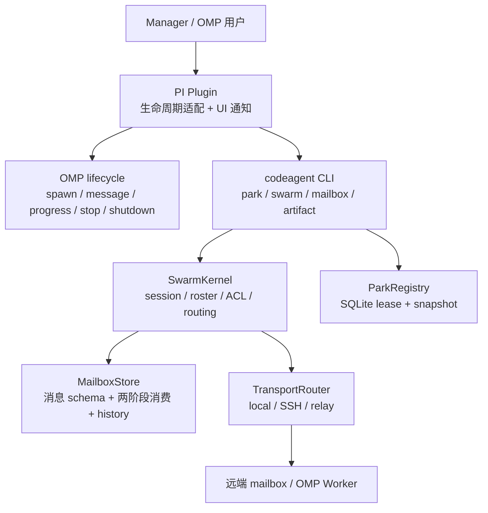
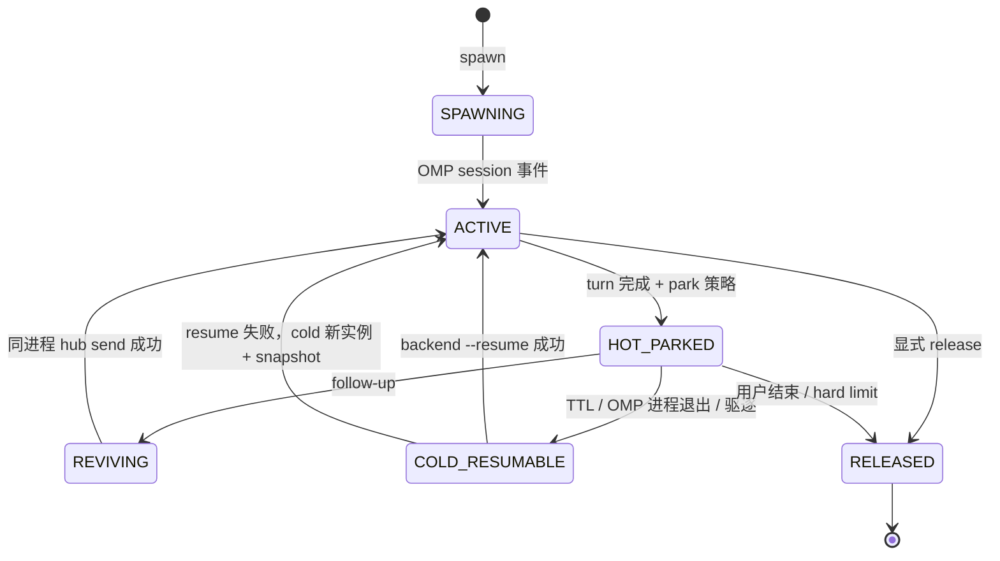

# PI Plugin 迁移方案

> 目标：将 OMP（Oh My Pi）中的 agent 编排能力收敛为一个薄 plugin，将生命周期、恢复、进度展示与 mailbox 交互接入现有 `codeagent-py` 协议内核；不在 plugin 中复制路由、持久化或跨主机传输逻辑。
>
> 文档状态：迁移设计。现有实现与目标实现明确区分；目标行为需按迁移步骤逐项落地。

## 1. 架构：plugin 在 OMP lifecycle 中的位置

### 1.1 分层原则

`codeagent-py` 是协议与控制平面，PI plugin 是 OMP 运行时适配层：



关键约束：

1. plugin 不直接拼接 `.mailbox` 路径，不实现消息 schema，不绕过 `SessionManifest`/`SwarmKernel` 做远端路由。
2. plugin 调用稳定的 CLI 或等价 Python API；CLI、OMP plugin、Tmux backend 发送的消息必须使用同一 `Message`/`Envelope` schema。
3. `status.json` 仅是可用性快照；请求的 ACK、PROGRESS、DONE、BLOCKED 等结果以带 `request_id`/`run_id` 的 mailbox 事件为准。
4. plugin 只负责通知和 OMP UX 适配。读取消息仍由 agent/worker 按 `read → processing → finalize` 两阶段协议完成，避免 plugin 与手工消费者竞争 claim。

现有 `codeagent-py` 已具备：

- `src/codeagent/swarm/kernel.py`：session、roster、ACL、routing 与 direct/broadcast/channel。
- `src/codeagent/swarm/delivery.py`、`transport/router.py`：durable outbox、投递回执、local/SSH/relay 传输。
- `src/codeagent/mailbox/{protocol,store,cli}.py`：消息校验、原子文件存储、两阶段消费、history、附件引用。
- `src/codeagent/hooks/swarm_hooks.py`：`on_agent_start` 注册、`on_agent_message` 路由、`on_agent_stop` 注销。
- `src/codeagent/park/{registry,router}.py`：Park lease、TTL/LRU 驱逐与 Hot → Warm → Cold 决策。
- `OMPRunner`：解析 OMP JSONL 的 session/assistant/agent_end 事件，注入 mailbox identity，保存可见进度，并在 cleanup 时处理注册与 identity。

### 1.2 OMP lifecycle 映射

| OMP 生命周期点 | PI plugin 责任 | codeagent-py 责任 | 失败策略 |
|---|---|---|---|
| plugin/process startup | 读取 launcher 注入的 identity；校验 session/agent；启动 peek-only watcher | 校验 manifest、roster、identity 与 mailbox 根 | 身份不完整或不匹配时 fail closed，不激活通信 |
| `agent_start` / spawn 完成 | 将 OMP peer 与逻辑 `review_key`、mailbox agent、backend session 绑定；展示加入 swarm | `swarm register`/`on_agent_start` 持久化 location | 注册失败显式告警；不得伪造在线状态 |
| inbound mailbox 到达 | `mailbox peek` 触发 OMP 通知；将“有 N 条待处理消息”注入可见 UI | `mailbox read` 由 worker claim 消息 | watcher 不消费消息；通知不等于已读 |
| agent 发送消息 | 将 OMP 原生消息转换为 `Envelope`，保留 correlation 字段 | `swarm direct`/`mailbox send` 完成 ACL、幂等、投递 | CLI 非零退出码回显实际错误，不静默重试 |
| assistant progress / turn end | 展示最近进度、当前 request、耗时与状态；必要时写 progress view | 写 PROGRESS 事件与 status snapshot；维护 request ledger | status 与事件不一致时以 event ledger 为准 |
| agent 完成或 OMP `agent_end` | 按策略选择 hot park 或 release；发送 terminal/read receipt 通知 | `park acquire/renew/release`、REPORT/NOTICE 落盘 | snapshot/terminal 写入失败必须暴露并保留现场 |
| `session_shutdown` | 停止 watcher、取消本进程订阅、清理本次 identity；不删除审计 history | 注销 ephemeral location；保留 warm/cold manifest 与 mailbox history | 已 park 的 agent 不得被 shutdown 清理成不可恢复 |

### 1.3 生命周期与恢复状态

plugin 负责触发和呈现，状态机由 ParkRegistry 与 CLI 驱动：



恢复层级必须保持以下语义：

- Hot：同一 OMP 进程与 generation 内，保留 peer registry 和完整上下文；plugin 通过 `hub send` 或 OMP 原生唤醒。
- Warm：跨 CLI 调用，用 `codeagent run --session-key <review_key>` 复用 `backend_session_id`，底层 OMP 使用 `--resume`；首轮必须做上下文校验。
- Cold：新建实例并注入结构化 snapshot 与 artifact 引用；不得声称原实例仍存活。

plugin 不能把 `peer_agent_id`、`mailbox_agent_id`、`backend_session_id` 混为一个 ID。它们分别属于 OMP 进程、mailbox session、backend session 三个命名空间；ParkManifest 是跨层绑定的唯一记录。

## 2. 功能设计

### 2.1 Spawn、warm resume、release

#### Spawn

1. Manager 通过 `codeagent swarm create-session` 建立 session 与完整 roster。
2. Manager 通过 `codeagent swarm direct` 发送 INIT/TASK；跨主机由 `TransportRouter` 选择 SSH/relay。
3. plugin 从 launcher 注入的 `SWARM_SESSION_ID`、`OMP_WORKER_ID`、`OMP_MAILBOX_IDENTITY_FILE`、`MAILBOX_ROOT` 获取身份，不依赖 agent 自己写身份。
4. OMP 发出 session event 后，plugin/codeagent hook 调用 `on_agent_start`，注册 `(session_id, agent_id, host_alias, backend=omp)`。
5. plugin 回报 peer、backend session、mailbox agent 的绑定，并在 UI 中显示 `SPAWNING → ACTIVE`。

Spawn 的验收条件：注册可被 `swarm whoami` 查询；INIT 具备不可变 `request_id` 与 `run_id`；收到任务后可产生 ACKED 事件。

#### Warm resume

plugin 不自行保存完整对话，也不复制 OMP transcript。它按 `review_key` 查询 ParkManifest：

```text
park revive <review_key> --prompt "..."
  ├─ hot: 当前进程内 hub send 到 peer_agent_id
  ├─ warm: codeagent run --session-key <review_key>，使用 backend_session_id --resume
  └─ cold: 新实例 + latest snapshot + artifact refs
```

当前 `park router` 是纯决策层，实际执行由 CLI/manager 完成。迁移时 plugin 的调用层应复用该决策结果，不能把返回 `method=hot` 误当成已经完成 hot revive。Warm resume 必须：

- 复用 `backend_session_id`，不把 `session_key` 当作 OMP backend ID。
- 首轮发出上下文校验 prompt；校验失败显式降级 cold。
- 保留原 `review_key`、`request_id`/`run_id` 关联与 snapshot 引用。
- 在 UI 中显示实际 method、降级原因及最终 backend session ID。

#### Release

显式释放或 hard limit 到期时，plugin 调用 `codeagent park release <review_key>`，并发送带 correlation 字段的 terminal NOTICE/REPORT（若该 request 已有 terminal，遵守 terminal CAS，不重复写 terminal）。然后：

- 停止该 agent 的 OMP 订阅和新任务接收；
- 清理本次运行 identity 与临时 prompt 文件；
- 保留 ParkManifest、snapshot、mailbox history、artifact metadata，供审计和 cold reconstruction；
- 不删除 session manifest，不删除其他 agent 的 inbox，不用 `status.json` 覆盖 event ledger。

### 2.2 Mailbox 双向通信

#### Manager → Worker

- OMP plugin 接收用户/manager 的 dispatch 意图，调用 `codeagent swarm direct <session> --to <agent> --from <sender> --kind TASK ...`。
- 跨主机由 `SwarmKernel` 根据 SessionManifest 的 `AgentLocation` 路由；禁止 plugin 直接执行带猜测路径的远端命令。
- 原样透传 `subject`、`body`、`attachments`、`reply_to`、`request_id`、`run_id`、`causation_id`、`trace_id`。
- 投递回执只表示 inbox 已接受/写入；不把 delivered 当作 worker 已读。

#### Worker → Manager / Peer

- agent 通过 OMP message hook 或 plugin 提供的 send action 生成 REPORT、PROGRESS、EVIDENCE、QUESTION、RESPONSE、NOTICE。
- plugin 调用 `on_agent_message` 或 `swarm direct`，不直接写 store；`MailboxStore.send` 的 msg_id 幂等与 ACL 校验保持单一实现。
- 远端 Worker 回 Manager 使用 host-local mailbox；Manager 通过 `codeagent mailbox read --host <H>` 拉取，或按部署模式使用 kernel 的 receiver/stream。
- OMP UI 显示 source、target、kind、subject、request/run ID 和 delivery status，正文过长时只显示摘要与 artifact 引用。

### 2.3 进度可见

进度必须分为三层，避免把“最后一条可见文本”误当作任务完成：

1. **OMP 原生可见层**：解析 `assistant.message_end`，显示最近进度、当前 agent 与 elapsed time；保持有界缓冲，避免无限增长。
2. **协议事件层**：worker 按阶段发送 PROGRESS，携带原始 `request_id`、`run_id`，body 包含阶段、已完成量/总量（如可得）、下一步和阻塞原因（如有）。
3. **持久快照层**：写自身 `status.json`（IDLE/BUSY/DONE/BLOCKED）和 Park progress/snapshot。Manager 对任务结果只读 event ledger，status 仅用于当前可用性展示。

推荐 UI 状态：`SPAWNING`、`ACTIVE`、`WAITING_FOR_INPUT`、`HOT_PARKED`、`REVIVING`、`COLD_RESUMABLE`、`RELEASED`、`BLOCKED`。每个状态同时展示最近事件时间和来源，避免状态无来源。

### 2.4 已读通知

“已读”必须表示 worker 已经执行 `mailbox read` 并成功 claim 到 processing，而不是 plugin watcher 看到 inbox 文件。设计为：

1. plugin watcher 只调用 `mailbox peek`，收到新消息时提示“待处理 N 条”，不改变消息状态。
2. Worker/OMP agent 消费时调用 `mailbox read --owner <agent>`；协议事件将 request 从 `DISPATCHED` 推进到 `ACKED`。
3. plugin 在 agent UI 中显示 `ACKED / 已读`，并向发送方发送可关联的 ACK/NOTICE（实现时复用 request event ledger，不能新增一套未持久化状态）。
4. `finalize` 后显示 `RUNNING` 或 terminal 状态；`release` 则保持可重试，不能报告为已完成。
5. ACK/已读通知失败时，消息仍以本地 claim 为事实；发送方必须通过 event ledger/回程消息重试或标记 UNKNOWN/STALE，不得以 UI 推测替代事实。

## 3. 与现有 codeagent-py CLI 的关系

### 3.1 CLI 是权威边界，plugin 是 adapter

plugin 不替代 `codeagent-py` CLI，也不把 Python 代码复制到 TypeScript/OMP 运行时。职责划分如下：

| 能力 | PI plugin | 现有 CLI / Python |
|---|---|---|
| OMP hook 注册、UI 展示、用户交互 | 负责 | 不负责 |
| session/roster/ACL/routing | 调用 | `codeagent swarm` + `SwarmKernel` 权威实现 |
| 消息 schema、原子写入、claim/finalize/release | 不实现 | `mailbox` + `MailboxStore` |
| 跨主机 local/SSH/relay | 不实现 | `TransportRouter`、wire、remote exec |
| durable outbox、投递回执、幂等 | 不实现 | `DeliveryEngine` / mailbox store |
| hot/warm/cold park 决策与 lease | 触发、展示 | `codeagent park`、`ParkRegistry`、`park.router` |
| artifact 拉取与 SHA-256 校验 | 展示引用 | `codeagent artifact pull/verify` |
| OMP JSONL session/progress/end 解析 | 接收 OMP 事件并展示 | `OMPRunner` 已实现本地 CLI runner 解析与 hook bridge |

当前入口已经存在：

```bash
codeagent run ...
codeagent swarm create-session|register|direct|poll|watch|status ...
codeagent mailbox send|peek|read|finalize|release|status ...
codeagent park list|info|revive|release|acquire|renew|sweep ...
codeagent artifact pull|verify ...
```

`pyproject.toml` 还提供 standalone `mailbox`、`mailbox-hook`、`mailbox-health` console entrypoint。plugin 应优先调用这些稳定命令；需要同进程低延迟时，可调用已明确导出的 Python hook/API，但仍必须复用同一 kernel/store，而不是另建文件格式。

### 3.2 兼容与边界

- `codeagent run --session-key` 是逻辑命名空间；warm resume 的 OMP 参数必须使用已登记的 `backend_session_id`。
- `codeagent swarm direct` 是 Manager 的正式 dispatch 入口；bare `mailbox send` 仅作 bootstrap/诊断或明确的低层操作。
- `mailbox peek` 是通知入口；`mailbox read`/`finalize` 是 worker 消费入口。plugin 不得自动 read。
- 远端场景使用 `codeagent mailbox ... --host <H>` 或 kernel routing；不能假设 Manager 与 Worker 共享 `.mailbox` 文件系统。
- `status.json` 不能作为 terminal truth；报告完成前必须遵守 REPORT 附件校验和 request event ledger 规则。
- 现有 `OMPRunner` 已生成 per-run identity，并在非 hot-park 情况下 cleanup；plugin 迁移不得重复清理其他运行的 identity，也不得在 hot parked agent 上删除仍需恢复的身份。

## 4. 迁移步骤

### Phase 0：冻结契约与基线

1. 固化 plugin ↔ CLI 的命令/JSON 边界：版本、退出码、stdout/stderr、超时、幂等重试规则。
2. 固化身份映射：`review_key`、`peer_agent_id`、`mailbox_agent_id`、`backend_session_id`、`session_id`、`request_id`、`run_id`。
3. 以现有 `skills/agent-swarm/protocol/mailbox.md`、`SwarmKernel`、`MailboxStore`、ParkRegistry 为验收依据；记录 shared-FS 与 remote-transport 两种部署基线。
4. 明确 plugin 不消费 mailbox、不修改 Python 协议、不引入常驻 daemon 的非目标。

### Phase 1：建立 PI plugin 薄适配层

1. 增加 plugin manifest、版本与能力声明（spawn、resume、release、mailbox、progress、read receipt）。
2. 在 plugin startup 读取并验证 launcher identity；验证失败时 fail closed，并输出实际 session/agent/文件路径。
3. 实现 OMP hook adapter：`agent_start` → register、inbound notice → peek、outbound message → swarm direct、agent_end → park/release、shutdown → unsubscribe/cleanup。
4. 所有 CLI 调用统一封装为 typed command runner：参数数组传递、超时、退出码、结构化错误；禁止 shell 拼接。

### Phase 2：接通 spawn 与双向 mailbox

1. Manager 先通过 `swarm create-session` 建 manifest，再由 plugin/CLI 完成 register 与 INIT dispatch。
2. 将 OMP outbound message 映射为 `Envelope`，透传全部 correlation 与附件字段。
3. watcher 只做 peek 和 UI 提醒；agent 侧执行 read/finalize，并把 ACKED/PROGRESS/REPORT/NOTICE 送回统一 kernel。
4. 增加本地 shared-FS、跨主机 SSH、relay 三条路径的双向 smoke scenario，验证 msg_id 幂等、ACL、trace/correlation 字段和错误可见。

### Phase 3：接通 park 与恢复

1. 在 OMP turn end 采集 backend session ID 与最后可见进度，更新 ParkManifest/进度记录。
2. hot park 仅保留同 generation 可达 peer；进程退出或 TTL/LRU 后转为 `COLD_RESUMABLE`，保留 snapshot。
3. plugin 调用 `park revive` 后按 method 执行 hot hub send、warm `codeagent run --resume` 或 cold 新实例注入 snapshot。
4. 首轮 warm/cold 恢复执行上下文校验；失败必须可观察地降级并记录原因。
5. 明确 release 与 sweep 的并发锁、terminal CAS、identity 清理顺序，防止恢复中的实例被误释放。

### Phase 4：进度与已读 UX

1. 将 OMP assistant progress、mailbox PROGRESS、status snapshot 合并为带来源的时间线。
2. 实现 ACKED/已读展示与发送方回程通知；以 `mailbox read` claim 作为事实，不以 watcher peek 代替。
3. 在 UI 中区分 delivered、ACKED、RUNNING、DONE、BLOCKED、UNKNOWN/STALE；报告 artifact 校验失败必须显示为未完成。
4. 为长任务增加 bounded progress buffer、last event、request/run correlation 和超时 watchdog 展示。

### Phase 5：灰度、回滚与下线旧路径

1. 先只对 oracle-lite 启用 plugin park/resume，再扩大到 oracle/oracle-opus；观察 revive 成功率、cold 降级率、hot parked 数、资源占用和 mailbox 延迟。
2. 任何 plugin 失败都可回退到 `codeagent run` + `codeagent swarm/mailbox` CLI；回滚不删除 session、history、snapshot 或 artifact。
3. 通过类型检查、plugin 单元测试、codeagent-py 现有测试和真实双向 smoke 验证后再扩大范围。
4. 迁移完成后删除重复的 plugin-local mailbox/store/bin 与旧 hook 兼容层，只保留一个 CLI/协议实现；更新 README、CHANGELOG 和安装脚本。

## 验收清单

- [ ] plugin 能在 OMP startup 识别正确 session/agent，身份不匹配时 fail closed。
- [ ] spawn 后 register 可查询，INIT/TASK 的 request/run correlation 不丢失。
- [ ] Manager → Worker 与 Worker → Manager/Peer 双向消息在本地、SSH、relay 路径均可达。
- [ ] watcher 只 peek；worker read/finalize/release 的两阶段语义可观察，ACKED/已读通知不造假。
- [ ] progress 在 OMP UI、PROGRESS 事件、status/snapshot 中可追踪，且终态以 event ledger 为准。
- [ ] hot、warm、cold 三种恢复路径和失败降级可验证；warm 使用 backend session ID。
- [ ] release、TTL/LRU sweep、session shutdown 不误删可恢复数据，identity 清理无跨运行误伤。
- [ ] plugin 失败可回退至现有 CLI；没有第二套 mailbox schema、路由或持久化格式。
